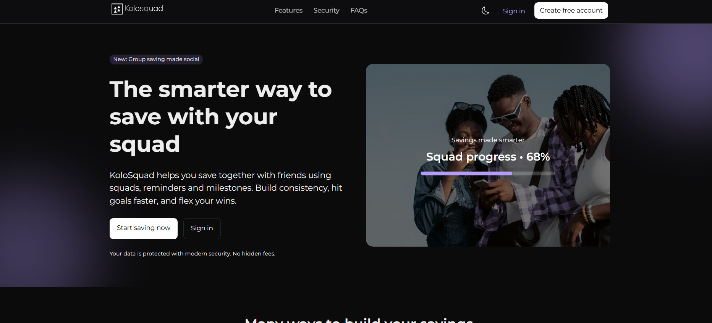

# KoloSquad

A modern, full-stack web application built with Next.js and TypeScript for team collaboration and saving together.

**Live Demo:** [kolosquad.vercel.app](https://kolosquad.vercel.app)

## Overview

KoloSquad is a sleek, responsive web application designed to help teams save together. Built with cutting-edge web technologies, it provides a seamless user experience with real-time data synchronization and intuitive UI components.

## Screenshot


## Tech Stack

### Frontend
- **Framework:** [Next.js 16](https://nextjs.org) - React framework for production
- **Language:** [TypeScript](https://www.typescriptlang.org) (96.9% of codebase)
- **Styling:** 
  - [Tailwind CSS](https://tailwindcss.com) - Utility-first CSS framework
  - [PostCSS](https://postcss.org) - CSS transformations
- **UI Components:**
  - [Radix UI](https://www.radix-ui.com) - Headless UI component library
  - [Shadcn/ui](https://ui.shadcn.com) - High-quality React components
  - [Lucide React](https://lucide.dev) - Beautiful SVG icons
- **Animation:** [Framer Motion](https://www.framer.com/motion) - Production animation library

### State Management & Data
- **State Management:** [Zustand](https://github.com/pmndrs/zustand) - Lightweight state management
- **Data Fetching:** [React Query](https://tanstack.com/query/latest) (TanStack Query v5) - Server state management
- **Forms:** [React Hook Form](https://react-hook-form.com) - Performant form management
- **Validation:** [Zod](https://zod.dev) - TypeScript-first schema validation
- **Date Handling:** [date-fns](https://date-fns.org) - Modern date utility library

### Backend & Database
- **Backend-as-a-Service:** [Supabase](https://supabase.com) - PostgreSQL database with real-time capabilities
- **Image Processing:** [html-to-image](https://html2image.com) - Convert DOM to images

### Utilities
- **Styling Utilities:**
  - [clsx](https://github.com/lukeed/clsx) - Utility for constructing className strings
  - [Tailwind Merge](https://github.com/dcastil/tailwind-merge) - Merge Tailwind CSS classes
  - [Class Variance Authority](https://cva.style/docs) - CSS-in-JS for component variants
- **Icons:** [React Icons](https://react-icons.github.io/react-icons) - Popular icon library

## Project Structure

```
KoloSquad/
├── app/                    # Next.js app directory (page routes and layouts)
├── components/             # Reusable React components
├── lib/                    # Utility functions and helpers
├── stores/                 # Zustand state stores
├── types/                  # TypeScript type definitions
├── supabase/               # Supabase configuration and queries
├── public/                 # Static assets
├── styles/                 # Global styles and CSS modules
├── package.json            # Project dependencies
├── tsconfig.json           # TypeScript configuration
├── next.config.ts          # Next.js configuration
├── tailwind.config.js      # Tailwind CSS configuration
└── components.json         # shadcn/ui components configuration
```

## Getting Started

### Prerequisites
- Node.js 18+ or Bun
- npm, yarn, pnpm, or bun package manager

### Installation

1. **Clone the repository:**
   ```bash
   git clone https://github.com/Derin-09/KoloSquad.git
   cd KoloSquad
   ```

2. **Install dependencies:**
   ```bash
   npm install
   # or
   pnpm install
   # or
   yarn install
   # or
   bun install
   ```

3. **Set up environment variables:**
   Create a `.env.local` file in the root directory with your Supabase credentials:
   ```env
   NEXT_PUBLIC_SUPABASE_URL=your_supabase_url
   NEXT_PUBLIC_SUPABASE_ANON_KEY=your_supabase_anon_key
   ```

4. **Run the development server:**
   ```bash
   npm run dev
   # or
   pnpm dev
   # or
   yarn dev
   # or
   bun dev
   ```

5. **Open your browser:**
   Navigate to [http://localhost:3000](http://localhost:3000) to see the application.

## Available Scripts

- `npm run dev` - Start the development server
- `npm run build` - Build the application for production
- `npm start` - Start the production server
- `npm run lint` - Run ESLint for code quality checks
- `npm run typecheck` - Run TypeScript type checking

## Development

### Code Quality

The project includes:
- **ESLint** - JavaScript/TypeScript linting
- **TypeScript** - Static type checking
- **Tailwind CSS** - Consistent styling

### Component Development

Components are built using:
- Radix UI for accessible base components
- shadcn/ui for pre-built, customizable components
- Tailwind CSS for styling
- Framer Motion for animations

### State Management

- **Global State:** Zustand for application-wide state
- **Server State:** React Query for server-side data caching and synchronization

## Deployment

This project is configured for deployment on [Vercel](https://vercel.com), the creators of Next.js.

### Deploy to Vercel

1. Push your code to GitHub
2. Import the repository in [Vercel](https://vercel.com/new)
3. Add your environment variables
4. Deploy!

The application is currently deployed at [kolosquad.vercel.app](https://kolosquad.vercel.app)

## Author

Created by [Derin-09](https://github.com/Derin-09)

---

**Built with ❤️ using modern web technologies**
